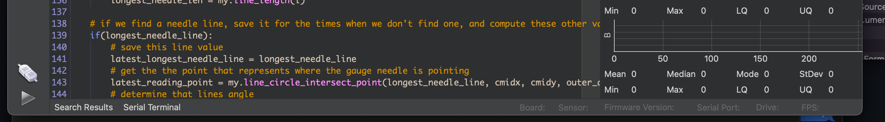
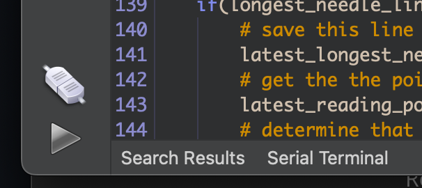
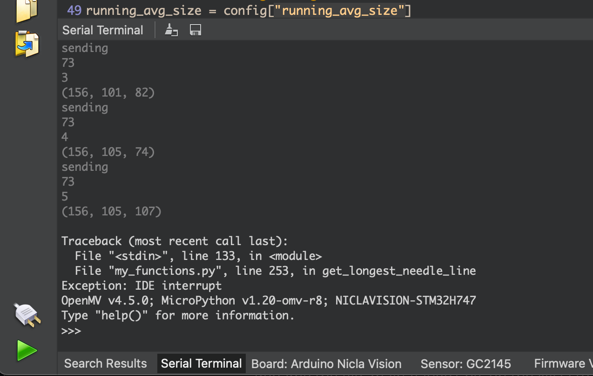
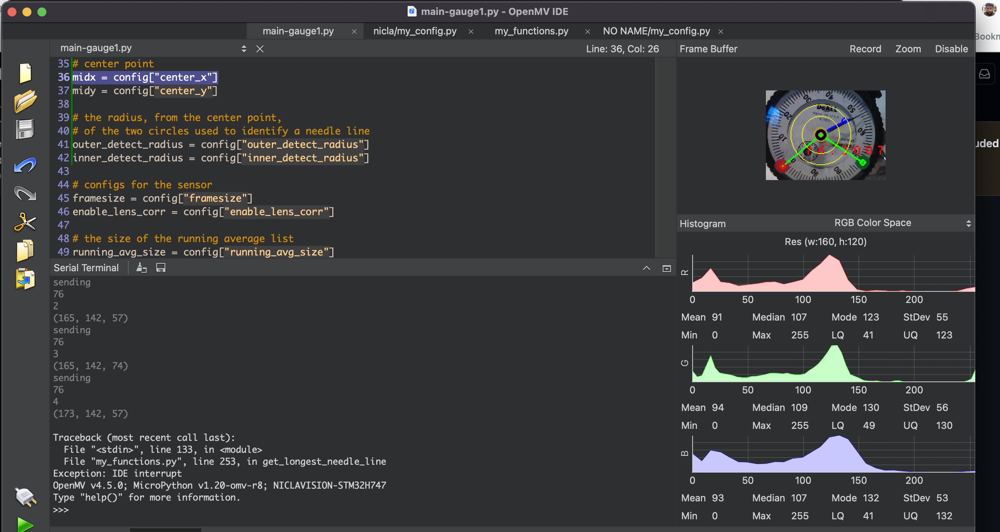
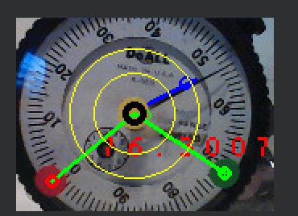
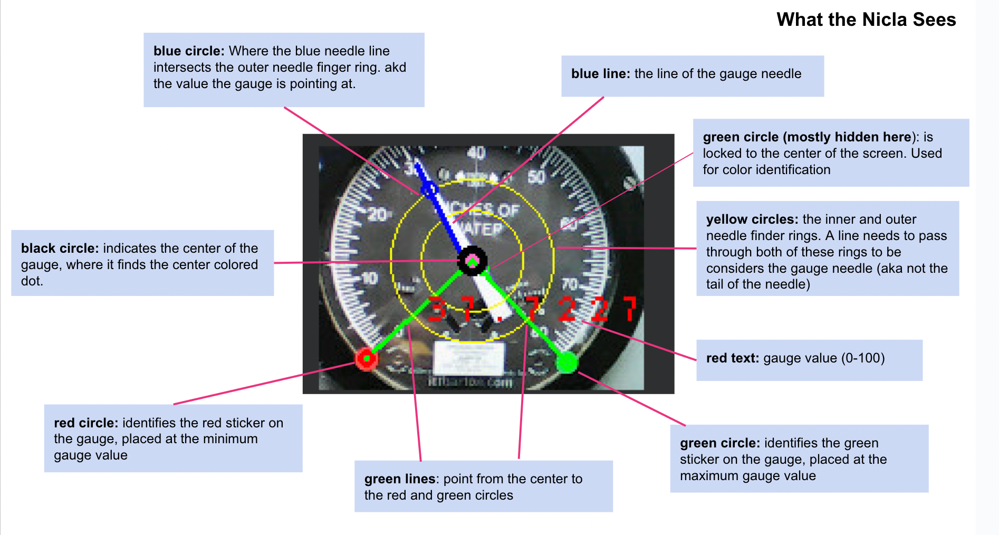

# Install OpenMV

[Download | OpenMV](https://openmv.io/pages/download)

Follow the setup instructions here: https://docs.arduino.cc/tutorials/nicla-vision/getting-started

- in particular, note the part where it says "***Before proceeding with the tutorial, please update the board's bootloader following the instructions below.***" Don't skip that part

## dfu-utils errors

Sometimes you'll be invited but OpenMV to upgrade the firmware on the Nicla. When you do this, on some OSes (for me it was an older Mac laptop running Big Sur), you might get errors like 

"**Upgrading nicla firmware…. Error updating firmware: dfu-util: Invalid DFU suffix signature dfu-util: A valid DFU suffix will be required in a future dfu-util release!!! dfu-util: dfuse_download: libusb_control_transfer returned -9**"

The only thing that worked for me was to switch to a more modern Mac, in my case a 2020 Mac laptop running Monterey

# Nicla as USB Drive

When the Nicla is attached, it should show up as an attached storage device, like a USB drive. You can add files to the Nicla just by copying files to this drive.

# Installing the Gauge Reader Software

Download github repo: [GitHub - reelyactive/nicla-vision-gauge-reader ](https://github.com/reelyactive/nicla-vision-gauge-reader)

Copy the contents of the folder `nicla` to the Nicla

- you need to do this so that the files my_config.py and my_functions.py are on the Nicla, if not, when you run main-gauge1.py, it won't find the files

Once you've done this, you can run main-gauage1.py in OpenMV

NOTE: you can run main-gauge1.py from anywhere, it doesn't have to be the version currently loaded on the Nicla itself. This can lead to confusion, so try to be clear about which version you're using

## Serial Monitor

If the nicla is running while attached to OpenMV, you can see any `print` statements in the Serial Terminal:

Click on "Serial Terminal" to open the Serial Terminal:

(note the values in the Parens, we'll come back to that)

## To Run Code Independantly on the Nicla

Rename the file  main-gauge1.py  on the Nicla to main.py

When the Nicla starts up on its own, it will run the file main.py

## Frame Buffer

The Frame Buffer on the right of the UI shows what the Nicla is looking at, along with additional graphics we've drawn on the captured image. This is important for setting up the device.

# Tweaking the Nicla

## my_config.py

my_config.py should be the only file you need to edit, depending on your installation requirements. The file is heavily commented. Make sure you're editing the my_congif.py that's on the Nicla itself

# Physical setup

The nicla should be setup while attached to a laptop running the, so you can see what the nicla sees in the Frame Buffer.   

Set it up so that the gauge fills the screen:

### What the graphics on the gauge mean

### A Note about the framebuffer output

You'll notice that the graphics seem to pop in an out. That's because in each detection loop, the sensor doesn't always detect all the parts. The goal is to get it setup so that it detects the RIGHT values most of the time, NO value sometimes, and WRONG values almost never.

**There are two ways to set up the Nicla to look at the gauge:**

1.  Position it really carefully so that the center of the gauge and the minimum and maximum gauge values are at known positions. Then define those positions in the my_config.py file. You can iterate toward correct values by looking at the graphics drawn over the framebuffer image

2. Use colored dots to indicate the minimum and maximum gauge values and the center of the gauge. Currently the colors are
   
   1. **Red**: minimum gauge value
   
   2. **Green**: maximum gauge value
   
   3. **Yellow**: Center of the gauge

## Setting up Color Dots

Depending on lighting conditions, configuration of the color detection configurations may need to be tweaked.

These colors are defined in terms of a RANGE in the LAB colorspace, defined in an array that looks like this: 

`(LMin, LMax, AMin, Amax, BMin, BMax)`
Any pixel that is within that range will be identified as that color. In real world situations, the same physical color might require a different threshold set, depending on lighting or other conditions.

**If a colored dot is not being detected correctly, try creating a new threshold**

- Turn on the Serial Terminal 

- Start the code running when the nicla is pointed at the gauge in the intended setup. It's important to START it with the nicla in the right place, because the camera calibrates itself to it's starting conditions

- Point the small green circle in the center of the Frame Buffer view at the colored dot you want to match

- Take note of the 3-value array being output in the Serial Terminal

- This is the LAB value of the pixel in the center of the image

- create na RANGE array, with values about +/- 10 from the given value, so eg

- (52, -1, 13) becomes (42, 62, -9,11, 3, 23 )
  
  - NOTE that the first value is LIGHTNESS, so you could try a wider range on that.

- Plug this new range array into the my_config.py, following the instructions there.

- Run the code again and see if it works!
